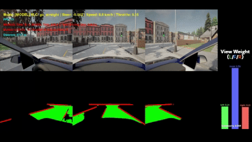
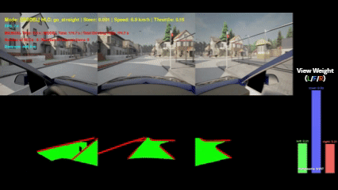
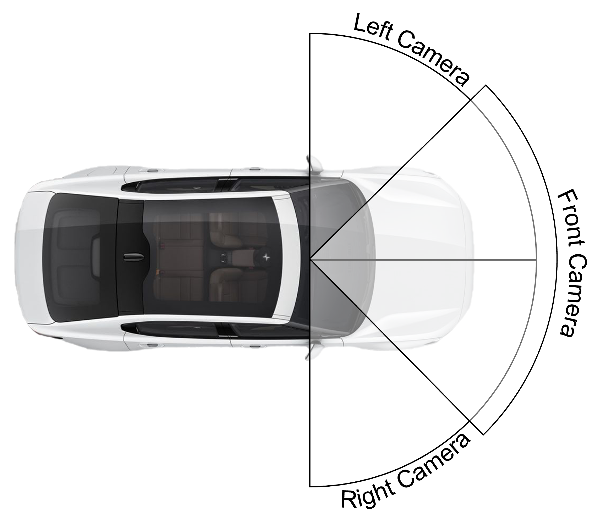
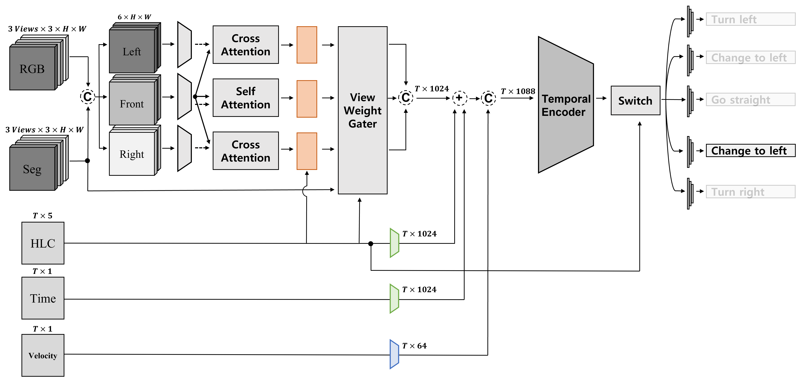
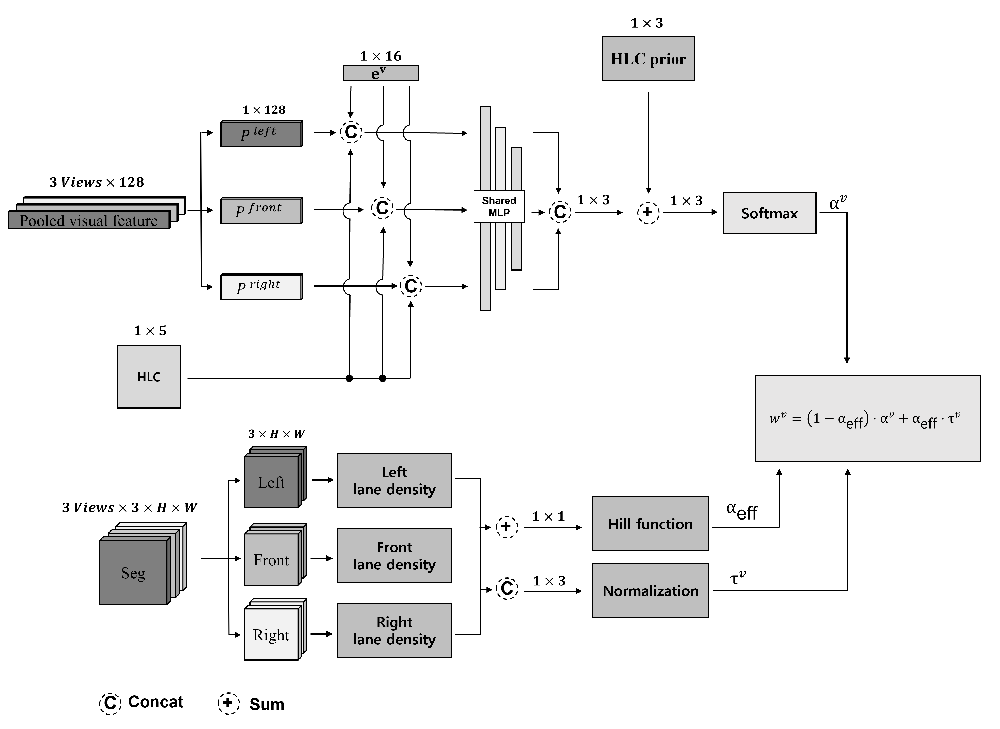

# End-to-End-Self-Driving-with-ViT-Based-Multi-View-Perception-and-Intention-Aware-View-Weighting
A multi-view image–based lateral control system for autonomous vehicles using conditional imitation learning with left, front, and right camera inputs.

---

📌 Overview
---
This research accompanies the research titled :

"End-to-End Self-Driving with ViT-Based Multi-View Perception and Intention-Aware View Weighting" by Dong-Hyun Kim and Yong-Gu Lee

And

This repository provides a dataset collected in the CARLA simulator (v0.9.15) for End-to-End autonomous driving research. The dataset includes synchronized multi-view camera images (left, front, right), corresponding steering commands, vehicle speed, and High-Level Commands (HLC), all obtained using CARLA’s built-in Autopilot.

---

🚘 Research Objective
---
This work proposes an end-to-end autonomous driving model that dynamically adjusts attention across left, front, and right views based on the human driver’s driving intention, and further refines view importance according to road complexity even under the same intention.

---

🎥 Driving Demo
---
### 1) Lane change to the left
Sensor Setup

### 2) Lane change to the right

### 3) Ture left

### 4) Ture right

### 5) Go straight

---

🧩 System Overview
---
### 📍 Sensor Setup

### 📍 Real-Time Inference Platform
| Component | Specification |
|----------|---------------|
| CPU | Intel(R) Core(TM) i7-14700KF (3.40 GHz) |
| RAM | 32 GB |
| GPU | NVIDIA GeForce RTX 4060 (8 GB) |

### 📍 Model Architecture

#### Full Model

#### ViewWeightGater

