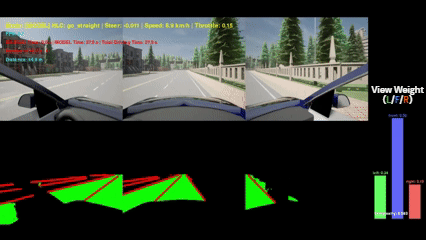

# End-to-End-Self-Driving-with-ViT-Based-Multi-View-Perception-and-Intention-Aware-View-Weighting
A multi-view image–based lateral control system for autonomous vehicles using conditional imitation learning with left, front, and right camera inputs.

---


📌 Overview
---

This research accompanies the research titled :

"**End-to-End Self-Driving with ViT-Based Multi-View Perception and Intention-Aware View Weighting**" by Dong-Hyun Kim and Yong-Gu Lee

And

This repository provides a dataset collected in the CARLA simulator (v0.9.15) for End-to-End autonomous driving research. The dataset includes synchronized multi-view camera images (left, front, right), corresponding steering commands, vehicle speed, and High-Level Commands (HLC), all obtained using CARLA’s built-in Autopilot.

---

🚘 Research Objective
---
This work proposes an end-to-end autonomous driving model that dynamically adjusts attention across left, front, and right views based on the human driver’s driving intention, and further refines view importance according to road complexity even under the same intention.


---


🎥 Driving Demo
---
### 1) Lane change to the left


### 2) Lane change to the right


### 3) Ture left


### 4) Ture right


### 5) Go straight


---


🧩 System Overview
---
### 📍 Sensor Setup


### 📍 Real-Time Inference Platform
| Component | Specification |
|----------|---------------|
| CPU | Intel(R) Core(TM) i7-14700KF (3.40 GHz) |
| RAM | 32 GB |
| GPU | NVIDIA GeForce RTX 4060 (8 GB) |


### 📍 Model Architecture

#### ▶ Full Model


#### ▶ ViewWeightGater


---


🗺️ Driving Maps (Top View)
---
#### ▶ Data Collection Map (CARLA Town05)


| CARLA Version | v0.9.15 |
|--------------|---------|

#### ▶ Number of Data Sequences

| High-Level Command        | Number of Data Sequences | Proportion of Data Sequences |
|---------------------------|--------------------------|------------------------------|
| Turn Left                 | 3,040                    | 20.4%                        |
| Turn Right                | 3,953                    | 26.6%                        |
| Change to Left Lane       | 806                      | 5.4%                         |
| Change to Right Lane      | 1,219                    | 8.2%                         |
| Go Straight               | 5,855                    | 39.4%                        |
| **Total**                 | **14,873**               | **100%**                     |

**Note:** Each data sequence consists of **five temporally consecutive frames** captured during a **single continuous driving episode**, ensuring temporal continuity within each sequence.

#### ▶ Inference Maps (CARLA Town01, 02)


**Left:** Driving paths (Path 1–3) in CARLA Town01. **Right:** Driving paths (Path 1–3) in CARLA Town02.


---


## 📊 Experimental Results


### ▶ Performance Metrics of the Proposed Model (Internal Dataset Evaluation)

| Town | Path | Autonomous Driving Time [s] | Intervention Time [s] | Total Driving Time [s] | Autonomy [%] | Number of HLC | Number of Interventions | Driving Distance [m] | HLC Policy |
|------|------|-----------------------------|------------------------|------------------------|--------------|----------|--------------------|----------------------|------------|
| Town01 | Path1 | 459.6 | 3.6 | 463.2 | 99.2 | 13 | 1.2 | 1107.7 | As provided |
| Town01 | Path2 | 550.3 | 8.5 | 558.8 | 98.5 | 19 | 3.4 | 1334.1 | As provided |
| Town01 | Path3 | 523.0 | 3.3 | 526.3 | **99.4** | 21 | 1.2 | 1259.6 | As provided |
| **—** | **—** | **—** | **—** | **—** | **—** | **—** | **—** | **—** | **—** |
| Town02 | Path1 | 294.6 | 25.5 | 320.1 | 92.0 | 1 | 4.0 | 759.8 | As provided |
| Town02 | Path2 | 352.5 | 21.6 | 374.1 | **94.2** | 13 | 4.2 | 892.3 | As provided |
| Town02 | Path3 | 262.7 | 20.0 | 282.7 | 92.9 | 13 | 3.2 | 669.0 | As provided |
| **—** | **—** | **—** | **—** | **—** | **—** | **—** | **—** | **—** | **—** |
| Town02 | Path1 | 311.1 | 8.1 | 319.2 | 97.5 | 9 | 1.4 | 760.2 | Overridden (L/R) |
| Town02 | Path2 | 364.0 | 7.6 | 371.6 | **98.0** | 19 | 1.6 | 890.1 | Overridden (L/R) |
| Town02 | Path3 | 270.8 | 10.9 | 281.7 | 96.1 | 17 | 2.4 | 666.0 | Overridden (L/R) |

**Intervention Criteria:** center-lane crossing, HLC violation, collision with road structures, curb mounting, prolonged lane invasion (>3 s), and traffic rule violations.

### ▶ Intervention Intervals and Driving Stability Metrics of the Proposed Model (Internal Dataset Evaluation)

| Town | Path | Mean Time Between Intervention [s] | Mean Distance Between Intervention [m] | Commands per Distance [commands/km] | Interventions per Command | HLC Policy |
|------|------|------------------------------------|----------------------------------------|-------------------------------------|---------------------------|------------|
| Town01 | Path1 | 211.9 | 503.7 | 11.7 | 0.09 | As provided |
| Town01 | Path2 | 181.2 | 436.4 | 14.2 | 0.18 | As provided |
| Town01 | Path3 | 90.8 | 217.2 | 16.7 | **0.06** | As provided |
| **—** | **—** | **—** | **—** | **—** | **—** | **—** |
| Town02 | Path1 | 78.2 | 189.8 | 13.2 | 4.00 | As provided |
| Town02 | Path2 | 88.7 | 216.7 | 14.6 | 0.32 | As provided |
| Town02 | Path3 | 77.5 | 189.2 | 19.4 | **0.25** | As provided |
| **—** | **—** | **—** | **—** | **—** | **—** | **—** |
| Town02 | Path1 | 165.6 | 394.5 | 11.8 | 0.16 | Overridden (L/R) |
| Town02 | Path2 | 88.8 | 217.6 | 21.3 | **0.08** | Overridden (L/R) |
| Town02 | Path3 | 58.5 | 142.7 | 25.5 | 0.14 | Overridden (L/R) |

**HLC Policy:** *As provided* uses manually assigned HLCs based on road structure, while *Overridden (Left/Right)* replaces *Go Straight* with left/right commands for sharp curves in the Town02 inference map (Sharp Curve 1–4).

### ▶ Comparison with Prior CIL-Based Methods (External Dataset Evaluation)

#### 🗺️ Start–Goal Pairs in CARLA Town02

| ID | Start Node | Goal Node |
|----|------------|-----------|
| 1  | 19         | 66        |
| 2  | 79         | 14        |
| 3  | 19         | 57        |
| 4  | 39         | 53        |
| 5  | 60         | 26        |
| 6  | 53         | 76        |
| 7  | 42         | 13        |
| 8  | 31         | 71        |
| 9  | 59         | 35        |
| 10 | 47         | 16        |
| 11 | 10         | 61        |
| 12 | 66         | 3         |
| 13 | 20         | 79        |
| 14 | 14         | 56        |
| 15 | 26         | 69        |
| 16 | 79         | 19        |
| 17 | 2          | 29        |
| 18 | 16         | 14        |
| 19 | 5          | 57        |
| 20 | 77         | 68        |
| 21 | 70         | 73        |
| 22 | 46         | 67        |
| 23 | 34         | 77        |
| 24 | 61         | 49        |
| 25 | 21         | 12        |

*Each start–goal pair was evaluated twice in CARLA Town02 (50 episodes in total), and the success rate was used as the primary evaluation metric.*

| Task  | CIL | CILR | CILRS | **ViewSelective-CIL (Ours)** |
|-------|-----|------|-------|-----------------------------|
| Empty | 24  | 66   | 90    | **96**                      |

*Baseline results (CIL, CILR, CILRS) are reported from Codevilla et al. (2018, 2019) under the same NoCrash (New Town & Weather) evaluation protocol.*


---


## 💰 Funding

This work was supported by the Institute of Information & communications Technology Planning & Evaluation (IITP) grant funded by the Korea government (MSIT) (No. 2019-0-01842, Artificial Intelligence Graduate School Program (GIST)), Korea Institute for Advancement of Technology (KIAT) grant funded by the Korea Government (MOTIE) \[P0020535, The Competency Development Program for Industry Specialist\] and GIST Research Project grant funded by the GIST in 2025, and The Regional Innovation System & Education (RISE) program through the Gwangju RISE Center, funded by the Ministry of Education (MOE) and the Gwangju Metropolitan City, Republic of Korea. (2025-RISE-05-001).


---


## 📂 Train Data

### ▶ Download
| Item        | Format        | Capacity| Link |
|-------------|---------------|---------------|------|
| Dataset     | `.tar`        | 155GB         |[Download](https://drive.google.com/file/d/1xLyuhKd9q_cJK7o3R9xm2IkiuxvZGr6e/view?usp=sharing)|
| Dataset     | `.zip`        | 88.8GB        |[Download](https://drive.google.com/file/d/15_IH4bndvWdm6GI6JY4SUrKMmx9bJk2q/view?usp=sharing)|

**Note:** The training dataset provided in this repository was entirely collected in the CARLA Town05 environment using CARLA’s built-in AutoPilot functionality.


### ▶ Extract files (Ubuntu)

```bash
# tar archives (dataset only)
tar -xvf Train_data.tar -C /desired/path

# zip archives (dataset only)
unzip Train_data.zip -d /desired/path
```


### ▶ Dataset Structure

```bash
Train_data.tar (or .zip)
├── raw/
│   ├── left/        (26,050 RGB images)
│   ├── center/      (26,050 RGB images)
│   ├── right/       (26,050 RGB images)
│   └── control_log.csv
│
└── npy/
    ├── left/        (26,050 .npy files: Road / Lane / Background)
    ├── center/      (26,050 .npy files: Road / Lane / Background)
    ├── right/       (26,050 .npy files: Road / Lane / Background)
    └── control_log.csv
```
The `control_log.csv` file contains the following fields: `HLC`, `Velocity`, `Steer`, `Throttle`, `Brake`, and `seq_idx`.
Samples sharing the same `seq_idx` correspond to **five consecutive frames collected during a continuous driving segment**, indicating temporally contiguous data rather than isolated observations.


---

## 📄 Paper
Paper:

---

## 📬 Contact
**Dong-Hyun Kim**<br>
M.S. Student, Department of Mechanical and Robotics Engineering<br>
Gwangju Institute of Science and Technology (GIST), Republic of Korea<br>
krym0309@gm.gist.ac.kr or krym0309@naver.com


